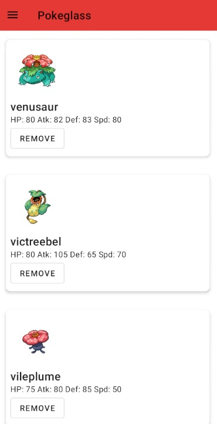

<!-- Improved compatibility of back to top link: See: https://github.com/othneildrew/Best-README-Template/pull/73 -->

<!--
*** Thanks for checking out the Best-README-Template. If you have a suggestion
*** that would make this better, please fork the repo and create a pull request
*** or simply open an issue with the tag "enhancement".
*** Don't forget to give the project a star!
*** Thanks again! Now go create something AMAZING! :D
-->

<!-- PROJECT LOGO -->
 

  

<h3 align="center">PokèGlass</h3>

  

    Pokéglass is an Android app written in Kotlin that allows users to search for their favorite Pokémon and view their information such as name and basic stats. Save your favorite Pokémon locally and stay up-to-date with the latest Pokémon data.
     
    <a href="https://github.com/gerardocipriano/pokeglass-android-app"><strong>Explore the docs »</strong></a>
     
     
    <a href="https://github.com/gerardocipriano/pokeglass-android-app">View Demo</a>
    ·
    <a href="https://github.com/gerardocipriano/pokeglass-android-app/issues">Report Bug</a>
    ·
    <a href="https://github.com/gerardocipriano/pokeglass-android-app/issues">Request Feature</a>
  

<!-- TABLE OF CONTENTS -->

  
Table of Contents

  <ol>
    <li>
      <a href="#about-the-project">About The Project</a>
      <ul>
        <li><a href="#built-with">Built With</a></li>
      </ul>
    </li>
    <li>
      <a href="#getting-started">Getting Started</a>
      <ul>
        <li><a href="#prerequisites">Prerequisites</a></li>
        <li><a href="#installation">Installation</a></li>
      </ul>
    </li>
    <li><a href="#usage">Usage</a></li>
    <li><a href="#roadmap">Roadmap</a></li>
    <li><a href="#contributing">Contributing</a></li>
    <li><a href="#license">License</a></li>
    <li><a href="#contact">Contact</a></li>
    <li><a href="#acknowledgments">Acknowledgments</a></li>
  </ol>

<!-- ABOUT THE PROJECT -->
## About The Project

 

  

The goal of developing this Android App is to create a simple and intuitive user experience for creating and managing your own Pokémon team.

(<a href="#readme-top">back to top</a>)

### Built With

- Kotlin
- Android Studio

(<a href="#readme-top">back to top</a>)

<!-- GETTING STARTED -->
## Getting Started

This is an example of how you may give instructions on setting up your project locally.
To get a local copy up and running follow these simple example steps.

### Prerequisites

At least Android 4.4+

### Installation

1. Simply get the apk contained in this Repo and install it on your android device.

(<a href="#readme-top">back to top</a>)

<!-- USAGE EXAMPLES -->
## Usage

### Pokedex

From the main page, you can browse and search for your favorite Pokémon. Once you have decided which Pokémon you would like to add to your team, simply click the “Add” button. Please note that you cannot have more than one Pokémon with the same name on your team, and your team can have a maximum of 6 Pokémon.

 

  

### Team

From this page, you can view all the Pokémon that you have added to your team. You can consult their base stats and remove them from your team if you wish.

 

  

(<a href="#readme-top">back to top</a>)

<!-- ROADMAP -->
## Roadmap

### Mandatory Features

- [ ] The application must<b> use API calls to fetch and display  pokedex data</b> in your app.
- [ ] <b>Favorite Pokémon search</b>: The application must allow users to search for their favorite Pokémon using keywords or filters.
- [ ] <b>Information display:</b> The application must display information about the searched Pokémon, such as its name, image, and basic statistics such as attack, defense, and speed.
- [ ] <b>Favorite Pokémon saving:</b> The application must allow users to save their own Pokémon team (max. 6) locally using a database.

### Optional Features

- [ ] Users can save more than one pokemon team 

See the [open issues](https://github.com/gerardocipriano/pokeglass-android-app/issues) for a full list of proposed features (and known issues).

(<a href="#readme-top">back to top</a>)

<!-- CONTRIBUTING -->
## Contributing

Contributions are what make the open source community such an amazing place to learn, inspire, and create. Any contributions you make are **greatly appreciated**.

If you have a suggestion that would make this better, please fork the repo and create a pull request. You can also simply open an issue with the tag "enhancement".
Don't forget to give the project a star! Thanks again!

1. Fork the Project
2. Create your Feature Branch (`git checkout -b feature/AmazingFeature`)
3. Commit your Changes (`git commit -m 'Add some AmazingFeature'`)
4. Push to the Branch (`git push origin feature/AmazingFeature`)
5. Open a Pull Request

(<a href="#readme-top">back to top</a>)

<!-- LICENSE -->
## License

Distributed under the MIT License. See `LICENSE.txt` for more information.

(<a href="#readme-top">back to top</a>)

<!-- CONTACT -->
## Contact

Gerardo Cipriano - gerardo.cipriano@studio.unibo.it

Project Link: [https://github.com/gerardocipriano/pokeglass-android-app](https://github.com/gerardocipriano/pokeglass-android-app)

(<a href="#readme-top">back to top</a>)

<!-- MARKDOWN LINKS & IMAGES -->
<!-- https://www.markdownguide.org/basic-syntax/#reference-style-links -->
[contributors-shield]: https://img.shields.io/github/contributors/github_username/repo_name.svg?style=for-the-badge
[contributors-url]: https://github.com/gerardocipriano/pokeglass-android-app/graphs/contributors
[forks-shield]: https://img.shields.io/github/forks/github_username/repo_name.svg?style=for-the-badge
[forks-url]: https://github.com/gerardocipriano/pokeglass-android-app/network/members
[stars-shield]: https://img.shields.io/github/stars/github_username/repo_name.svg?style=for-the-badge
[stars-url]: https://github.com/gerardocipriano/pokeglass-android-app/stargazers
[issues-shield]: https://img.shields.io/github/issues/github_username/repo_name.svg?style=for-the-badge
[issues-url]: https://github.com/gerardocipriano/pokeglass-android-app/issues
[license-shield]: https://img.shields.io/github/license/github_username/repo_name.svg?style=for-the-badge
[license-url]: https://github.com/gerardocipriano/pokeglass-android-app/blob/master/LICENSE.txt
[linkedin-shield]: https://img.shields.io/badge/-LinkedIn-black.svg?style=for-the-badge&logo=linkedin&colorB=555
[linkedin-url]: https://linkedin.com/in/linkedin_username
[product-screenshot]: images/screenshot.png
[Next.js]: https://img.shields.io/badge/next.js-000000?style=for-the-badge&logo=nextdotjs&logoColor=white
[Next-url]: https://nextjs.org/
[React.js]: https://img.shields.io/badge/React-20232A?style=for-the-badge&logo=react&logoColor=61DAFB
[React-url]: https://reactjs.org/
[Vue.js]: https://img.shields.io/badge/Vue.js-35495E?style=for-the-badge&logo=vuedotjs&logoColor=4FC08D
[Vue-url]: https://vuejs.org/
[Angular.io]: https://img.shields.io/badge/Angular-DD0031?style=for-the-badge&logo=angular&logoColor=white
[Angular-url]: https://angular.io/
[Svelte.dev]: https://img.shields.io/badge/Svelte-4A4A55?style=for-the-badge&logo=svelte&logoColor=FF3E00
[Svelte-url]: https://svelte.dev/
[Laravel.com]: https://img.shields.io/badge/Laravel-FF2D20?style=for-the-badge&logo=laravel&logoColor=white
[Laravel-url]: https://laravel.com
[Bootstrap.com]: https://img.shields.io/badge/Bootstrap-563D7C?style=for-the-badge&logo=bootstrap&logoColor=white
[Bootstrap-url]: https://getbootstrap.com
[JQuery.com]: https://img.shields.io/badge/jQuery-0769AD?style=for-the-badge&logo=jquery&logoColor=white
[JQuery-url]: https://jquery.com 
