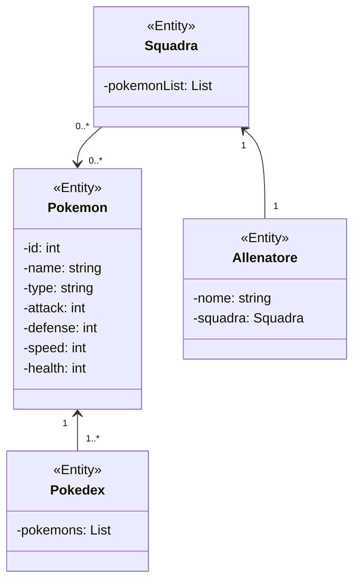
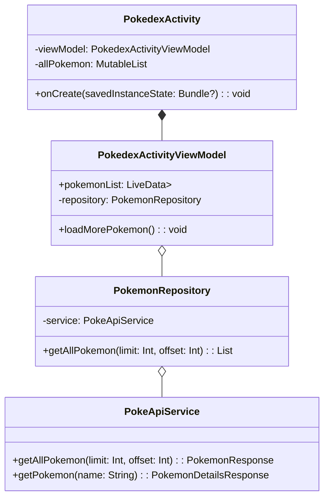
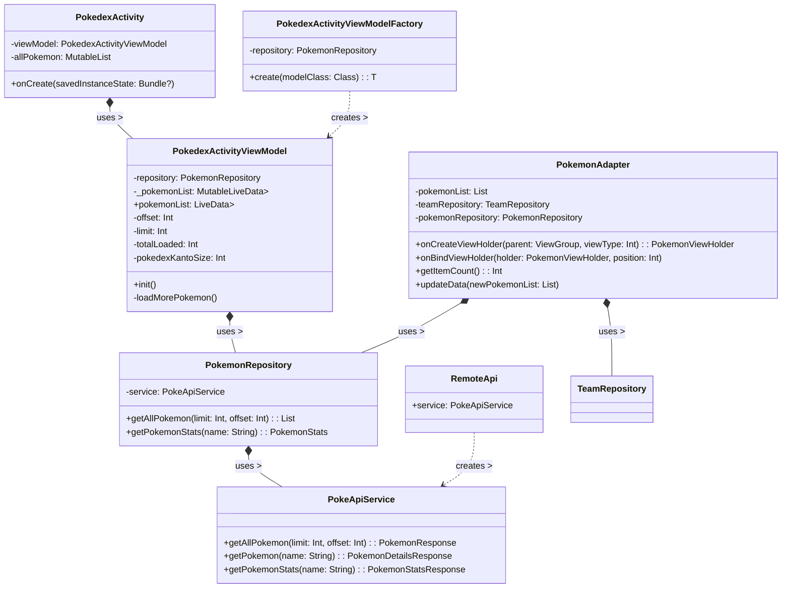
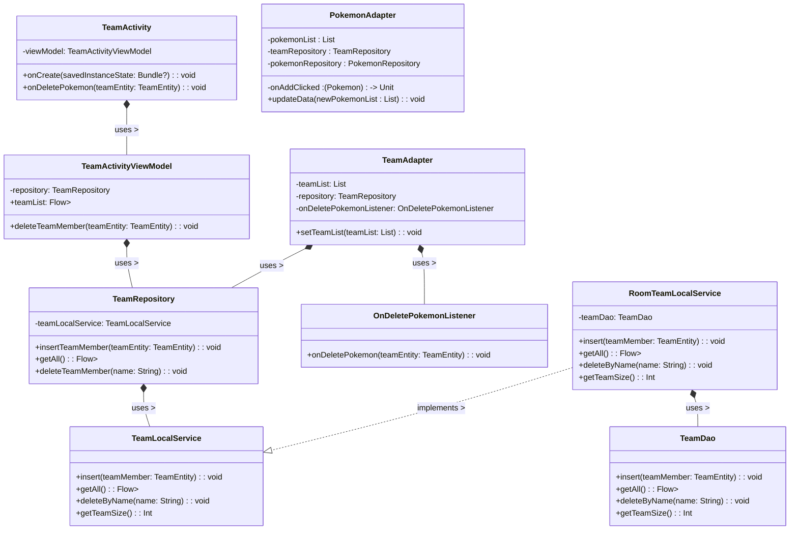

# Relazione Progetto per Esame Laboratorio di Programmazione di Sistemi Mobili

### Analisi

L'obbiettivo dello sviluppo di questa App Android è quella di creare un’esperienza d'uso semplice ed intuitiva per creare e gestire la propria squadra di Pokémon.

#### Requisiti funzionali

-   L'app permette la visualizzazione, sotto forma di elenco, del pokédex di prima generazione.
-   Dall'elenco sarà possibile scegliere fino a 6 pokemon con nomi diversi (non sono permessi duplicati), i quali rappresenteranno la squadra dell'allenatore.
-   Nell'interfaccia della squadra, l'allenatore potrà consultare le statistiche di base dei pokémon scelti.

#### Requisiti non funzionali

-   Supporto per pokedex esteso
-   Supporto multi-team, per organizzare più squadre

### Analisi e modello del Dominio

Le entità principali coinvolte nel dominio applicativo sono:
<b>Pokémon:</b> ogni Pokémon ha un nome, un tipo e un set di statistiche di base, che includono attacco, difesa, velocità e salute. Ogni Pokémon è identificato da un nome univoco all’interno dell’applicazione.
<b>Pokédex:</b> il Pokédex rappresenta un elenco di tutti i Pokémon di prima generazione. Ogni voce del Pokédex contiene il nome del Pokémon, il suo tipo e l’ID corrispondente.
<b>Squadra:</b> la squadra dell’allenatore è composta da un massimo di 6 Pokémon selezionati dal Pokédex. La squadra può essere visualizzata nell’interfaccia dell’applicazione, dove sono disponibili le statistiche di base di ogni Pokémon.
<b>Allenatore:</b> l’allenatore è l’utente dell’applicazione, che seleziona i suoi Pokémon preferiti per creare la propria squadra e gestire la propria esperienza di gioco.

I rapporti tra le entità sono i seguenti:
Ogni voce del Pokédex corrisponde a un Pokémon, identificato da un nome univoco.
L’allenatore può selezionare fino a 6 Pokémon dal Pokédex per creare la propria squadra.
Ogni Pokémon nella squadra dell’allenatore è identificato dal suo nome univoco all’interno dell’applicazione.
L’interfaccia dell’applicazione consente all’allenatore di visualizzare le statistiche di base dei Pokémon selezionati nella squadra.

Gli elementi costitutivi del dominio sono sintetizzati nella seguente figura.

Un aspetto particolarmente impegnativo del dominio applicativo potrebbe essere l’identificazione univoca dei Pokémon e l’associazione tra i Pokémon nel Pokédex e nella squadra dell’allenatore, evitando duplicati nella squadra.

Il requisito non funzionale riguardante l'ampliamento del pokédex richiederà
studi specifici sulle performance di Pokéglass (il caricamento di tutta la lista è particolarmente pesante)
che non potranno essere effettuati all'interno del monte ore previsto: tale feature sarà oggetto
di futuri lavori.

# Design

Per recuperare l’elenco aggiornato dei Pokémon, utilizzeremo l’API pubblica di PokeAPI, che ci fornisce tutti i dati relativi ai Pokémon della prima generazione.

Per quanto riguarda il design architetturale dell’applicazione Android, possiamo utilizzare il pattern architetturale Model-View-ViewModel (MVVM) che favorisce la separazione delle responsabilità tra le diverse componenti dell’applicazione e quindi la modularità e la manutenibilità del codice.

Nello specifico, l’architettura MVVM prevede la suddivisione dell’applicazione in tre componenti principali:

Model: si occupa di gestire i dati dell’applicazione, inclusi i dati ottenuti dall’API di PokeAPI. In particolare, possiamo utilizzare una classe chiamata PokemonRepository che utilizza Retrofit (una libreria per la gestione delle chiamate HTTP) per recuperare i dati dell’elenco dei Pokémon dall’API di PokeAPI e poi li restituisce al ViewModel.

View: si occupa di visualizzare i dati all’utente, attraverso l’interfaccia grafica dell’applicazione. In particolare, possiamo utilizzare un’activity chiamata PokedexActivity che mostra l’elenco dei Pokémon, e un’activity chiamata SquadraActivity che mostra la squadra dell’allenatore.

ViewModel: si occupa di gestire la logica dell’applicazione e di coordinare le interazioni tra il Model e la View. In particolare, possiamo utilizzare un ViewModel chiamato PokedexActivityViewModel che si occupa di recuperare i dati dell’elenco dei Pokémon e li restituisce alla PokedexActivity, e un ViewModel chiamato TeamActivityViewModel che si occupa di gestire i dati relativi alla squadra dell’allenatore.

Inoltre, possiamo utilizzare la libreria di Android Architecture Components, che fornisce strumenti per la gestione del ciclo di vita delle activity e dei fragment dell’applicazione, e per la gestione della comunicazione tra il ViewModel e la View attraverso l’uso di LiveData.

Infine, per la gestione delle dipendenze, possiamo utilizzare Gradle come sistema di build.

Il concetto è esemplificato nel seguente diagramma UML architetturale.

## Design dettagliato

### Pokedex Activity

Si tratta dell'activity principale dell'applicazione. Consente la ricerca e la visualizzazione della lista di tutti i pokemon di prima generazione.
Sfrutta a pieno il design MVVM. Di seguito lo schema UML in cui è raffigurata in dettaglio la relazione e suddivisioni delle classi interessate:

Lo schema UML mostra l’architettura dell’app e come le diverse componenti interagiscono tra loro. L’architettura può essere suddivisa in quattro livelli.

Al livello più basso c’è l’oggetto RemoteApi, che è un singleton utilizzato per effettuare chiamate all’endpoint API. Questo oggetto è costruito utilizzando le librerie Retrofit2 e Moshi. L’interfaccia PokeApiService contiene i metodi che definiscono le query da eseguire per ottenere i dati necessari all’applicazione. Questo livello, definito nel package remote, è responsabile di effettuare la chiamata effettiva all’endpoint API.

Al terzo livello abbiamo il PokemonRepository, definito nel package data. La repository funge da tramite nella richiesta e ottenimento dei dati da Internet. In particolare, la repository effettua due chiamate all’API: la prima per ottenere i nomi dei Pokémon e la seconda per ottenere lo sprite del Pokémon una volta ottenuti i nomi.

In seguito abbiamo il viewModel PokedexActivityViewModel, che si trova nel package ui. Utilizzando i LiveData, si occupa di caricare e tenere aggiornata la lista man mano che arrivano le risposte alle richieste all’endpoint API.

La lista è rappresentata attraverso una RecyclerView, gestita dall’adapter PokemonAdapter. L’adapter utilizza la libreria Picasso per caricare e visualizzare lo sprite del Pokémon.

L’utilizzo di un pattern architetturale come questo aiuta a separare le responsabilità delle diverse componenti e a rendere il codice più modulare e manutenibile. Inoltre, l’utilizzo dei LiveData consente di gestire in modo efficiente l’aggiornamento dell’interfaccia utente in base ai cambiamenti dei dati sottostanti. In questo modo, l’applicazione può fornire un’esperienza utente fluida e reattiva.

### TeamActivity

La TeamActivity contiene l'elenco dei Pokemon scelti dall'utente per la sua squadra. La memorizzazione è effettuata in locale utilizzando la libreria Room. Per ciascun Pokemon, è presente un tasto per Rimuovere quel pokemon dalla squadra.

Lo schema UML presentato mostra l’architettura dell’applicazione Android divisa in quattro livelli: il livello “local”, il livello “data”, il livello “viewmodel” e il livello “view”.
Anche in questo caso i livelli corrispondono ai relativi package nel progetto.

Il livello “local” gestisce l’interazione con il database e l’implementazione della libreria Room. Questo livello è separato dagli altri per garantire un’astrazione dall’implementazione sottostante del database e per facilitare eventuali cambiamenti futuri nella gestione dei dati.

Il livello “data” contiene la classe TeamRepository, che funge da tramite tra il livello “viewmodel” e il livello “local”. Questo livello è separato dagli altri per garantire un’astrazione dall’implementazione sottostante del database e per facilitare la gestione dei dati.

Il livello "ui" contiene la classe TeamActivityViewModel, che utilizza un oggetto Flow per tenere aggiornata la rappresentazione del team dell’allenatore. Questo livello è separato dagli altri per garantire un’astrazione dalla rappresentazione dei dati e per facilitare la gestione della logica dell’applicazione.

Infine, il livello "adapter" contiene la classe TeamAdapter, che utilizza una RecyclerView per gestire la rappresentazione del team dell’allenatore. Questo livello è separato dagli altri per garantire un’astrazione dalla logica dell’applicazione e per facilitare la gestione della rappresentazione dei dati.

È interessante notare che l’applicazione effettua una doppia chiamata API: prima per ottenere il nome del Pokémon scelto e poi, a partire da questo nome, per ottenere lo sprite e le statistiche di base del Pokémon.

# Sviluppo

## Note di sviluppo

In questo progetto ho utilizzato il pattern architetturale MVVM per separare le diverse responsabilità e rendere l’applicazione più facile da testare e manutenere.

- Per entrambe le liste ho sfruttato una RecyclerView per gestire la rappresentazione dei dati in modo efficiente e fluido.

- Nella PokedexActivity, i Pokémon caricati inizialmente sono 6 per dare all’utente la percezione di un caricamento rapido. Dopo aver caricato i primi 6, il caricamento dei successivi Pokémon del Pokédex di Kanto continua in background. Man mano che si aggiungono Pokémon, il ViewModel utilizza i LiveData per caricare dinamicamente i nuovi elementi in modo fluido.

- La prima chiamata API a PokéAPI restituisce solo nome e URL del Pokémon. Per raccogliere ulteriori informazioni sul Pokémon, devo effettuare una doppia chiamata anche sul nome per ottenere i dettagli. Nella PokedexActivity uso la doppia chiamata per recuperare l’immagine del Pokémon e inoltre uso anche la libreria Picasso per mostrarla nel riquadro del Pokémon.

- Uso una doppia chiamata API anche per ottenere le statistiche base del Pokémon da mostrare poi nella TeamActivity. Questo consente di avere informazioni dettagliate sui Pokémon nel team dell’allenatore.

- Il team è memorizzato in un database utilizzando la libreria Room. Questo consente di gestire i dati in modo efficiente e sicuro.

- La lista di Pokémon nel team è caricata dal ViewModel come tipo di dato Flow. Questo consente di tenere aggiornata la rappresentazione del team dell’allenatore in modo reattivo.

- Per il design dell’applicazione ho usato il Material Design per garantire un’esperienza utente coerente e piacevole.

- Ho aggiunto una toolbar e una navbar per consentire all'utente di navigare agevolmente fra le due activity.

# Commenti finali

## Autovalutazione e lavori futuri

Alla fine sono soddisfatto del mio lavoro finale. Approcciarmi a Kotlin per la prima volta non è stato semplice, ma questo progetto mi ha permesso di prendere maggiore confidenza con il linguaggio. Ho avuto modo di sperimentare e mettere in pratica praticamente tutti i concetti che abbiamo visto a lezione. Questo è stato fondamentale per aiutarmi nella comprensione di quello che abbiamo visto.

Il progetto risponde a tutti i criteri che mi ero preposto all’inizio. Tuttavia, avendo sviluppato il progetto da solo, non sono riuscito a trovare il tempo per implementare migliorie più sostanziali all’aspetto grafico. Inoltre, all’applicazione mancano alcune funzionalità che la renderebbero più interessante. In una delle future versioni conto di aggiungere il supporto al multi-team e al Pokédex esteso. Purtroppo non sono riuscito a trovare un modo di effettuare questo supporto già da adesso perché il caricamento della lista sarebbe stato troppo lungo e avrebbe degradato di molto le performance.

In sintesi, questo progetto mi ha permesso di approfondire la mia conoscenza di Kotlin e dei concetti visti a lezione. Sono soddisfatto del risultato finale, ma continuerò a lavorare per migliorare l’applicazione in futuro.
